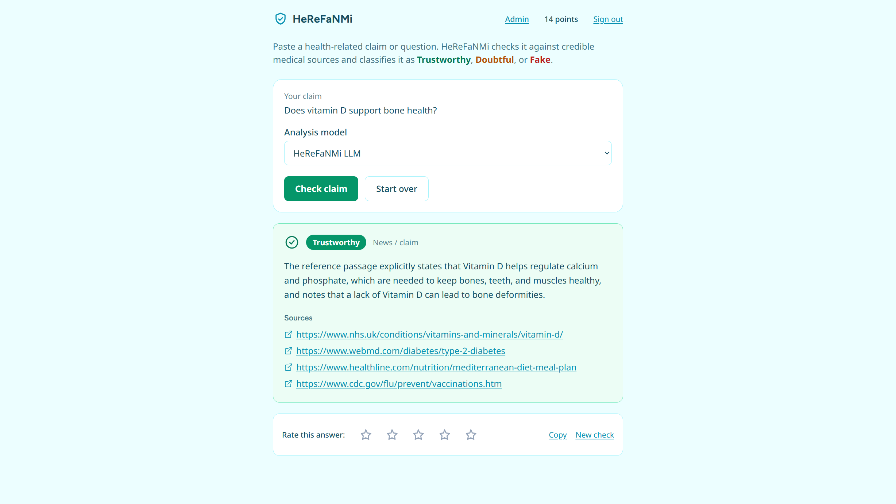
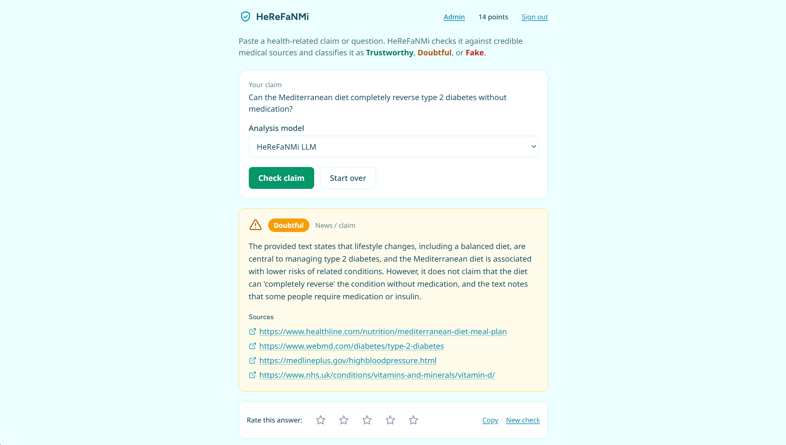
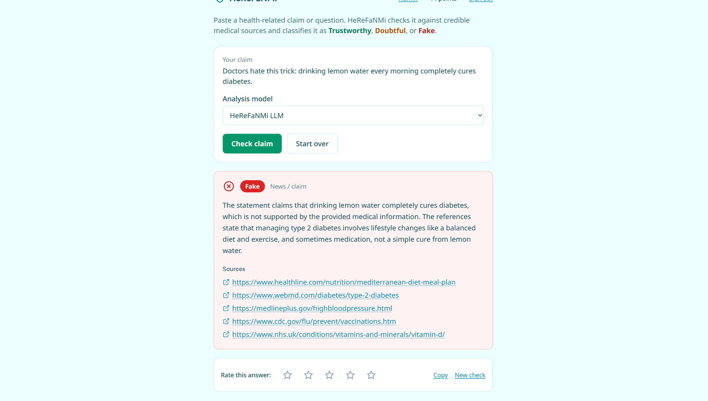
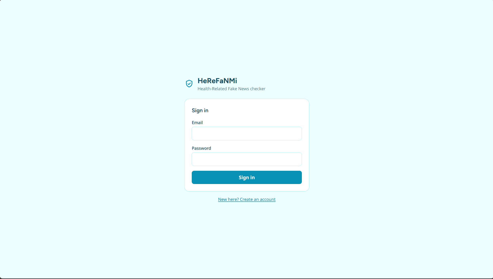
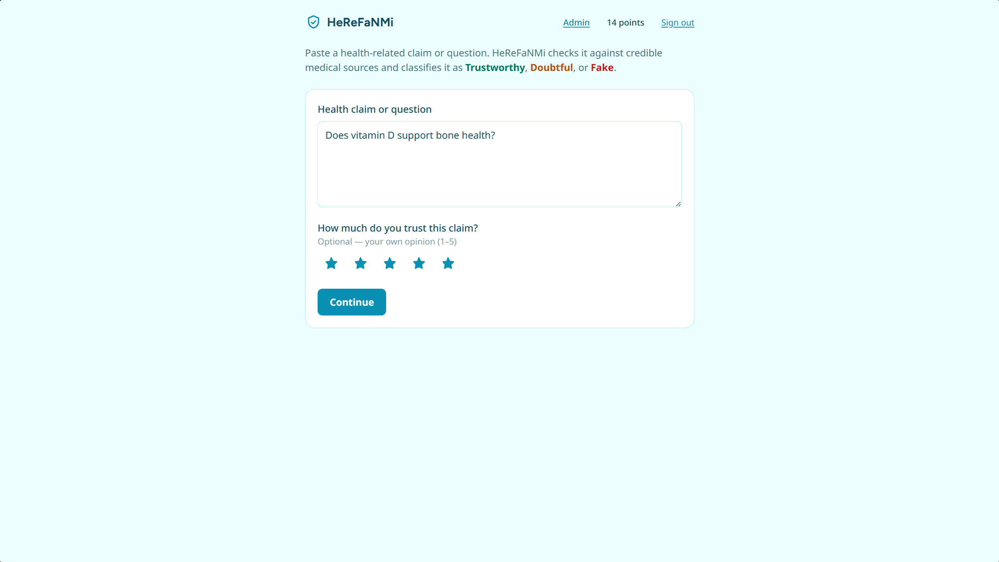
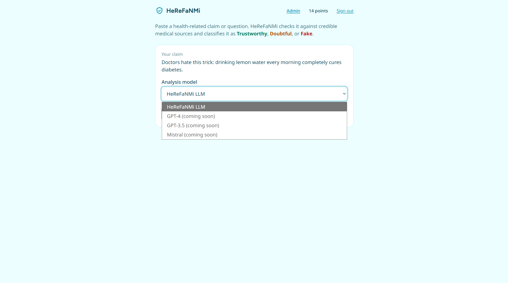
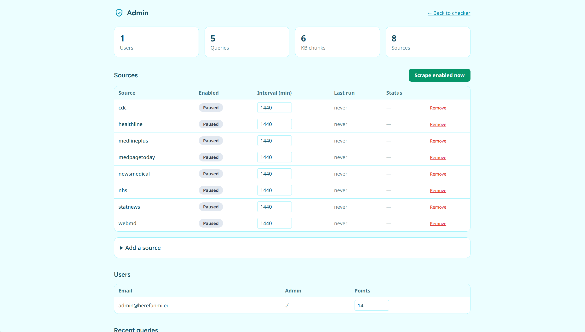
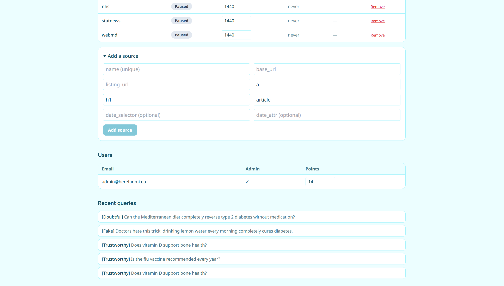
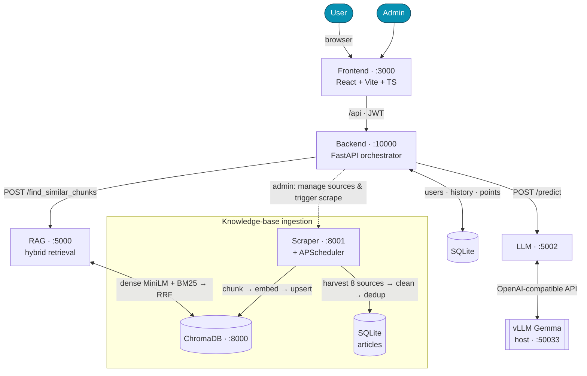
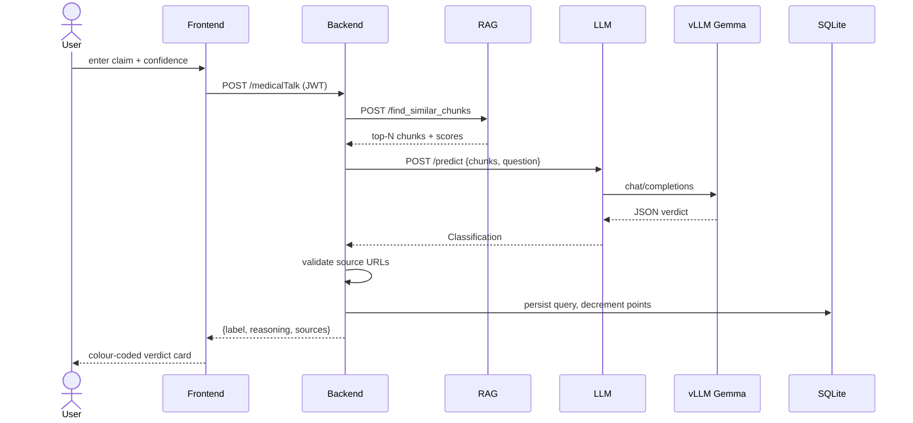

# HeReFaNMi — Health-Related Fake News Mitigation

An AI system that classifies health-related news/claims as **Trustworthy**,
**Doubtful**, or **Fake**, grounded in credible medical sources via
retrieval-augmented generation.

This is a from-scratch, test-driven rewrite of the original microservice stack.
It uses **FastAPI** services, **ChromaDB hybrid search** (dense + BM25), **SQLite**
for app data, an **OpenAI-compatible LLM** (a local vLLM Gemma server by default),
and a **React + Vite + TypeScript** frontend — all dockerized.

## Screenshots

Captured from the live app running against the real `google/gemma-4-E4B-it` model.

**The three verdicts** — every classification is colour- and icon-coded and grounded in retrieved medical sources:

| 🟢 Trustworthy | 🟡 Doubtful | 🔴 Fake |
|:---:|:---:|:---:|
|  |  |  |

**User flow** — sign in, enter a claim and your own confidence, then pick the analysis model:

| Sign in | Check a claim | Choose model |
|:---:|:---:|:---:|
|  |  |  |

**Admin panel** — knowledge-base stats, per-source scheduling (enable/pause, interval, add/remove), users, and recent query history:

| Overview &amp; sources | Add a source &amp; history |
|:---:|:---:|
|  |  |

## Architecture



The in-house path is **synchronous** (unlike the legacy fire-and-forget callback): the Backend awaits RAG, then the LLM, validates sources, persists, and replies.



The classification contract (preserved from the legacy system):
```json
{"medical":"True|False","news":"True|False","label":"Trustworthy|Doubtful|Fake","reasoning":"…","sources":["…"]}
```

## Layout

| Path | What |
|------|------|
| `shared/hrf_shared/` | Pydantic contracts, config, JSON parsing, Chroma client (reused by all services) |
| `services/scraper/` | Harvest CDC/NHS/MedlinePlus/STAT/MedPage/WebMD/News-Medical/Healthline → SQLite |
| `services/rag/` | ChromaDB hybrid retrieval (dense `all-MiniLM-L6-v2` + BM25, fused with RRF) |
| `services/llm/` | Classification via an OpenAI-compatible API (vLLM Gemma by default) |
| `services/backend/` | Orchestrator + JWT auth + SQLite persistence (the `/medicalTalk` entry point) |
| `ingest/` | `run_ingestion.py` (scrape → index) and `seed_sample_data.py` (bundled demo data) |
| `frontend/` | React + Vite + TS app (two-phase UX, color-coded verdict card) |
| `tests/` | pytest suites (TDD) mirroring every service + in-process E2E |
| `dataset-regenerate/` | Pre-existing synthetic-dataset generator (unchanged) |

## Documentation

Detailed docs live in [`docs/`](docs/):

- [Architecture](docs/architecture.md) — services, the synchronous request flow, hybrid retrieval, design decisions
- [Configuration](docs/configuration.md) — every `HRF_*` environment variable
- [API reference](docs/api-reference.md) — all service endpoints with examples
- [Development](docs/development.md) — setup, TDD layout, conventions, gotchas
- [Deployment](docs/deployment.md) — Docker, the GPU-free CI profile, seeding, production notes
- [Admin & scheduling](docs/admin-and-scheduling.md) — admin panel, editable sources, the per-source scheduler

## Quick start (Docker)

```bash
# Full stack against a host vLLM Gemma server on :50033
docker compose up --build

# GPU-free: run the bundled OpenAI-compatible stub instead of vLLM
HRF_LLM_BASE_URL=http://llm-stub:50033/v1 docker compose --profile ci up --build

# Seed demo data (sample articles → SQLite + ChromaDB)
docker compose run --rm seed
```

Then open http://localhost:3000, sign up, and check a claim. A one-shot smoke
test of the whole flow lives in `scripts/smoke_e2e.sh`.

## Local development (conda)

```bash
conda env create -f environment.yml      # or: make install
conda activate herefanmi
make test                                 # full pytest suite
make test-rag                             # one service
make lint                                 # ruff
```

Config is environment-driven (`HRF_*`); see `.env.example`. The LLM provider is
just `HRF_LLM_BASE_URL` / `HRF_LLM_MODEL` / `HRF_LLM_API_KEY`, so swapping vLLM
for OpenAI or any compatible endpoint is an env change.

> **Note on the model name:** the default `HRF_LLM_MODEL` is `google/gemma-4-E4B-it`.
> If your vLLM server actually serves `gemma-3n-E4B-it`, change that one env var.

## Background

HeReFaNMi is an EU NGI Search–funded project (NGI-SEARCH:18). See `CLAUDE.md` for
the legacy system and external resources.
