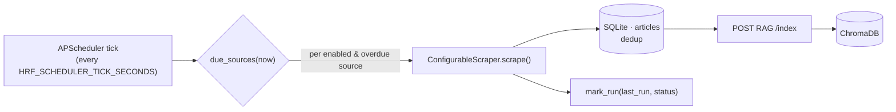

# Admin panel & scheduled scraping

The admin panel manages the knowledge base: which sources are harvested, how
often, plus users and query history. The matching screenshots are in the
[README gallery](../README.md#screenshots).

## Becoming an admin

Admins are designated by an **email allowlist**, `HRF_ADMIN_EMAILS`
(comma-separated, case-insensitive). On signup *and* login, a user whose email
is in the list gets `is_admin = true`; changing the env promotes/demotes on the
next login. The JWT response includes `is_admin`, and the frontend shows the
**Admin** link and the `/admin` route only to admins.

```bash
# docker compose / env
HRF_ADMIN_EMAILS=alice@org.eu,bob@org.eu
```

## What the panel shows

- **Stats cards** — Users, Queries, KB chunks, Sources (chunks come from RAG
  `GET /stats`).
- **Sources table** — every configured source with an enable/pause toggle, an
  editable interval (minutes), last-run time, last status, and a Remove action;
  plus **"Scrape enabled now"** and an **"Add a source"** form.
- **Users table** — email, admin flag, and an editable points value.
- **Recent queries** — the latest classified claims with their labels.

The Backend `/admin/*` endpoints enforce `is_admin`, read users/queries from its
own SQLite, pull chunk stats from RAG, and **proxy** source management +
scrape triggers to the Scraper service (`HRF_SCRAPER_URL`). See the
[API reference](api-reference.md#admin-is_admin-jwt).

## Sources are editable config (not code)

Each source is a row driving a generic `ConfigurableScraper`
([`configurable.py`](../services/scraper/hrf_scraper/configurable.py)) — there's
no per-source Python to deploy. A source is defined by CSS selectors:

| Field | Meaning |
|-------|---------|
| `name` | Unique key (also the Chroma metadata `source`). |
| `base_url` | Site root, used to resolve relative links. |
| `listing_url` | Index page listing article links. |
| `listing_link_selector` | CSS selector for article `<a>` links on the listing. |
| `title_selector` | CSS selector for the article title (default `h1`). |
| `content_selector` | CSS selector for the article body container (its `<p>`s are extracted). |
| `date_selector` / `date_attr` | Optional: where to read the publish date (attribute if `date_attr` set, else text). |
| `enabled` | Whether the scheduler runs it. |
| `interval_minutes` | Per-source cadence. |

The 8 built-in sources (CDC, NHS, MedlinePlus, STAT News, MedPage Today, WebMD,
News Medical, Healthline) are seeded **disabled** on first startup
(`HRF_SCRAPER_AUTOSTART`), with selectors taken from
[`registry.py`](../services/scraper/hrf_scraper/registry.py). Their listing-page
selectors are best-effort starting points — verify/tune them against the live
markup before relying on a source.

### Add / pause / remove

- **Add** — the panel's "Add a source" form, or `POST /sources`.
- **Pause/enable** — toggle in the table, or `PATCH /sources/{name}
  {"enabled": ...}`.
- **Change cadence** — edit the interval, or `PATCH .../{name}
  {"interval_minutes": ...}`.
- **Remove** — Remove link, or `DELETE /sources/{name}`.

## The scheduler

A per-source scheduler lives in the Scraper service
([`scheduler.py`](../services/scraper/hrf_scraper/scheduler.py)), built on
APScheduler. It is **off by default**.

```bash
HRF_SCHEDULER_ENABLED=true          # start the tick
HRF_SCHEDULER_TICK_SECONDS=300      # how often to check for due sources
HRF_SCRAPE_LIMIT=10                 # optional cap on articles/source/run
```

On each tick it computes the **due** sources — `due_sources(sources, now)`:
enabled, and either never run or `now - last_run_at >= interval_minutes` — then
for each:

1. scrape via `ConfigurableScraper` (fetch listing → fetch articles → parse),
2. clean + dedup, store new articles in SQLite,
3. push the new articles to RAG `POST /index` (chunk → embed → upsert),
4. record `last_run_at` + `last_status` (per-source errors are caught and
   recorded; one failing source never blocks the others).

`due_sources` is a pure function (you inject `now`), which is why it's directly
unit-tested. "Scrape enabled now" / `POST /run-now` runs all enabled sources
immediately regardless of timing.



## Gamification (points)

New users start with `HRF_SIGNUP_POINTS` (default 14). Each `/medicalTalk` query
decrements one point; at zero, non-admins get **403** (the UI shows "out of
points"). **Admins are unlimited** and never decremented. Admins can adjust any
user's points from the panel (`POST /admin/users/{uid}/points`). All point logic
is server-side in [`orchestrator.py`](../services/backend/app/orchestrator.py)
(the legacy split this between front- and back-end, which was buggy).
