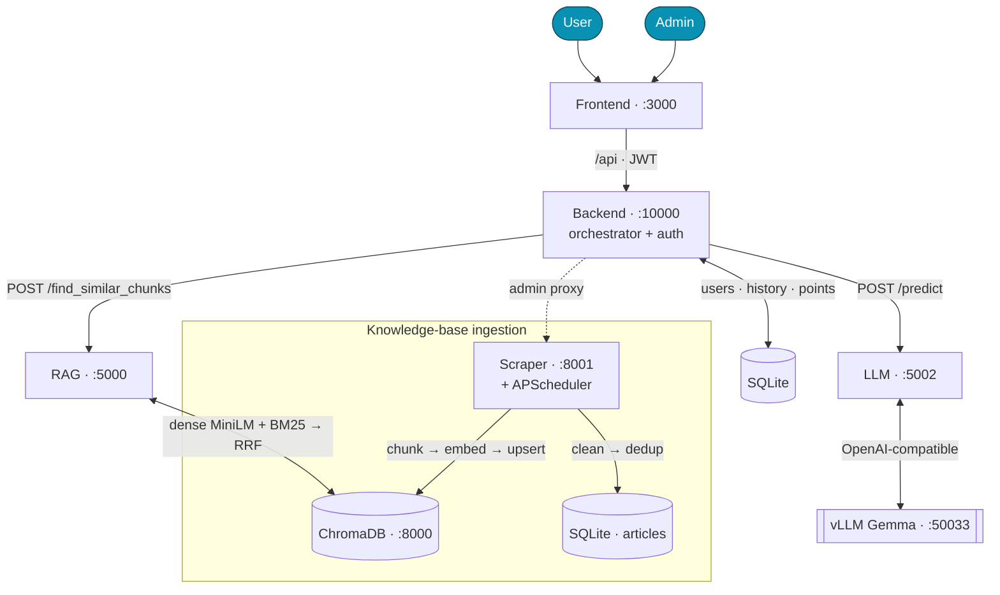
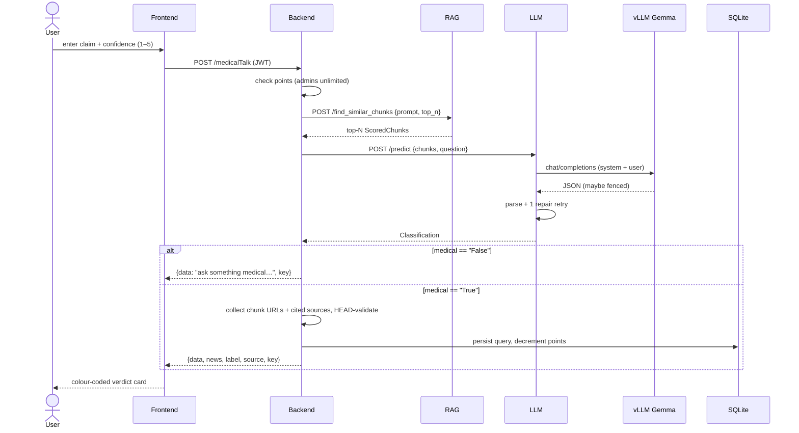

# Architecture

HeReFaNMi classifies a health-related claim as **Trustworthy**, **Doubtful**, or
**Fake** using retrieval-augmented generation: it retrieves evidence from a
knowledge base of credible medical sources, then asks an LLM to judge the claim
against that evidence and return a structured verdict.

## Services

| Service | Port | Stack | Responsibility |
|---------|------|-------|----------------|
| **Frontend** | 3000 | React + Vite + TS | Two-phase checker UX, JWT auth, admin panel |
| **Backend** | 10000 | FastAPI | Orchestrator + auth + persistence (the entry point) |
| **RAG** | 5000 | FastAPI + ChromaDB | Hybrid retrieval + indexing + KB stats |
| **LLM** | 5002 | FastAPI + OpenAI SDK | Prompt → provider → parsed `Classification` |
| **Scraper** | 8001 | FastAPI + BeautifulSoup | Source config, harvesting, APScheduler |
| **ChromaDB** | 8000 | `chromadb/chroma` | Vector store (dense + sparse corpus) |
| **vLLM** | 50033 | external | Serves `google/gemma-4-E4B-it` (OpenAI-compatible) |

Each Python service is independently testable and shares one package,
`hrf_shared` (`shared/hrf_shared/`): Pydantic contracts, env-driven `Settings`,
tolerant JSON parsing, and the Chroma client factory.



## Request flow: `/medicalTalk`

The in-house path is **synchronous** — a deliberate departure from the legacy
system, which used a fire-and-forget callback chain (RAG → LLM → a Backend
`/response` endpoint polled via a global slot with a 30 s timeout, with no
request correlation). The rewrite collapses that into one awaited chain in
[`orchestrator.py`](../services/backend/app/orchestrator.py):



If the LLM call fails (provider down, unparseable output after one repair), the
orchestrator returns a graceful **Doubtful** "try again later" card and does
**not** charge a point.

## Retrieval: ChromaDB hybrid search

RAG retrieval ([`hrf_rag/`](../services/rag/hrf_rag/)) fuses two signals so it
catches both semantic matches and exact-term matches:

1. **Dense** — `collection.query(query_texts=[prompt], n_results=K)` using
   `all-MiniLM-L6-v2` (384-dim) embeddings, cosine space.
2. **Sparse** — BM25 (`rank_bm25`) over the same corpus, deterministic
   lowercase+whitespace tokenization (`bm25.py`).
3. **Fusion** — Reciprocal Rank Fusion (`hybrid.py`): for each id,
   `score = Σ 1/(rrf_k + rank)` across both rankings; sorted desc, ties broken
   by id for determinism; top-N returned as `ScoredChunk`s carrying source + URL.

`K = max(dense_candidates, top_n)`. Tunables: `HRF_RRF_K`,
`HRF_DENSE_CANDIDATES`, `HRF_DEFAULT_TOP_N` (see
[configuration](configuration.md)).

## Classification contract

Every verdict conforms to this contract (`hrf_shared/contracts.py`), preserved
verbatim from the legacy system. `medical`/`news` are the **strings** "True"/
"False" (not booleans); the parser normalizes casing and rejects unknown labels.

```json
{
  "medical": "True|False",
  "news": "True|False",
  "label": "Trustworthy|Doubtful|Fake",
  "reasoning": "…",
  "sources": ["https://…"]
}
```

Tolerant parsing (`json_utils.py`) strips ```` ```json ```` fences and falls
back to the outermost `{…}`; the LLM service retries once with a "JSON only"
instruction before returning HTTP 502.

## Data stores

- **ChromaDB** — the vector knowledge base. Runs as a server container in
  Docker (writer = ingestion, reader = RAG); embedded (`persistent`/`ephemeral`)
  for local dev and tests. The scraper never touches Chroma directly — it pushes
  new articles to RAG `POST /index` over HTTP, keeping a single writer.
- **SQLite** — app data. The Backend owns `users`, `queries` (a row id is the
  `key`/`reference` returned to clients), and ratings. The Scraper owns
  `articles` and `sources` (admin-editable config). Replaces the legacy Firebase
  + Postgres + Mongo.

## Key design decisions

| Decision | Rationale |
|----------|-----------|
| Synchronous orchestration | Eliminates the legacy racy global-slot callback; each request is self-contained and testable. |
| OpenAI-compatible LLM provider | Provider is just `base_url`/`model`/`api_key` — swap vLLM ↔ OpenAI ↔ any compatible server with an env change; no in-process model weights. |
| SQLite (not Postgres/Firebase) | Lightweight, conda/pip-installable, zero DB server, trivial to seed and test; sufficient at this scale. |
| Hybrid (dense + BM25) | Dense alone misses exact terms (drug names, "COVID-19"); BM25 alone misses paraphrase. RRF needs no score calibration. |
| Persisted, admin-editable sources | Sources are config rows driving a generic `ConfigurableScraper`, so admins add/pause/remove sources and set per-source cadence at runtime — no code deploy. |
| Light text cleaning by default | Aggressive lowercasing/digit-stripping (legacy) destroys dosages, p-values, casing that embeddings rely on; opt-in only. |

## Repository layout

See the [README layout table](../README.md#layout). In short: `shared/` (the
contract package), `services/{scraper,rag,llm,backend}/`, `ingest/` (CLI +
sample data), `frontend/`, `tests/` (mirrors services), and `docs/`.
